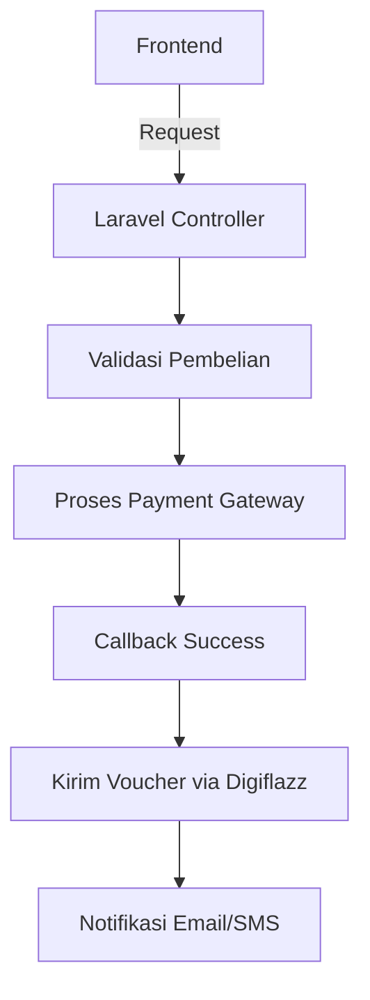

```markdown
# Context: Pembuatan Online Shop Game Digital dengan Laravel 10

## 📌 **Spesifikasi Proyek**
- **Framework**: Laravel 10
- **Target Produk**: 
  - Voucher game (Mobile Legends, Free Fire, Steam Wallet, dll)
  - Pulsa/PLN
  - Produk digital lainnya
- **Fitur Inti**:
  - Pembelian instan via API
  - Multi-payment gateway
  - Pengiriman otomatis
  - Admin panel manajemen produk

## 🔗 **Integrasi Eksternal**
1. **Digiflazz API**:
   - Endpoint: `https://api.digiflazz.com/v1`
   - Fungsi: 
     - Cek harga voucher game
     - Topup saldo
     - Transaksi pulsa
   - Key: `API_KEY_DIGIFLAZZ` (simpan di `.env`)

2. **Payment Gateway**:
   - **Midtrans** (untuk pembayaran kartu/VA)
     - Config: `MIDTRANS_SERVER_KEY`
   - **Xendit** (opsional alternatif)
     - Config: `XENDIT_API_KEY`

## 🛠️ **Arsitektur Sistem**


## 📂 **Struktur File Penting**
```
app/
├── Http/
│   ├── Controllers/
│   │   ├── DigiflazzController.php
│   │   ├── PaymentController.php
│   ├── Services/
│   │   ├── DigiflazzService.php
database/
├── migrations/
│   ├── 2024_products_table.php
routes/
├── api.php
```

## ⚡ **Endpoint Kritis**
```php
// routes/api.php
Route::post('/purchase', [PaymentController::class, 'purchase']);
Route::post('/payment-callback', [PaymentController::class, 'handleCallback']);
```

## � **Error Handling**
- Simpan log error di `storage/logs/digiflazz.log`
- Response standar:
```json
{
  "status": "error",
  "code": 400,
  "message": "Saldo tidak cukup"
}
```

## 🔐 **Keamanan**
- Validasi semua input request
- Enkripsi data sensitif di database
- Gunakan HTTPS wajib untuk callback

## 🚀 **Deployment Checklist**
1. Set environment variables:
   ```env
   DIGIFLAZZ_USERNAME=your_username
   DIGIFLAZZ_KEY=your_api_key
   MIDTRANS_SERVER_KEY=your_key
   ```
2. Jalankan scheduler untuk sync produk:
   ```bash
   php artisan schedule:run
   ```

## 📝 **Catatan Developer AI**
- Gunakan Laravel HTTP Client untuk API calls
- Implementasikan queue untuk pengiriman voucher
- Prioritas: Kecepatan transaksi > UI kompleks
``` 
